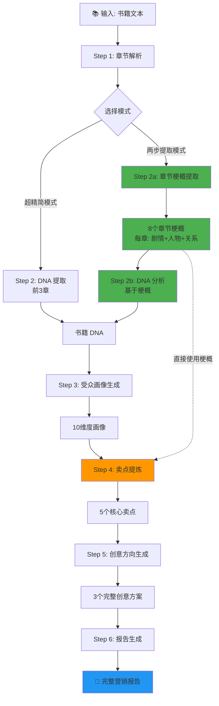
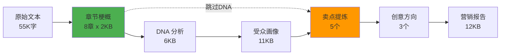
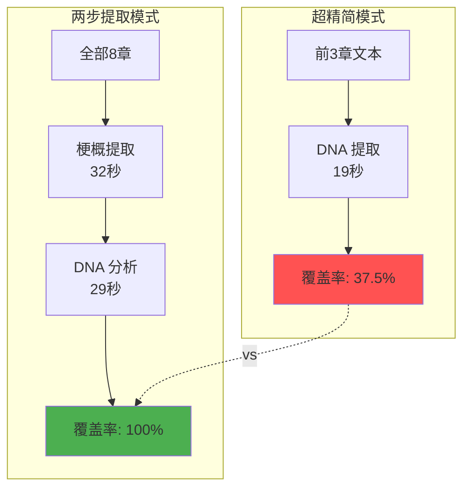
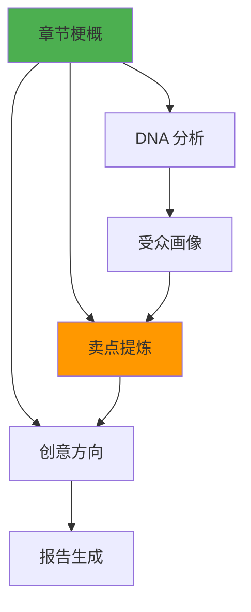

# 📊 Book Parser 两步提取模式流程图

## 完整工作流程

## 数据流向

## 时间分布

```mermaid
gantt
    title 两步提取模式 - 时间分布 (总计 195秒)
    dateFormat ss
    axisFormat %S秒
    
    section 解析
    章节解析           :done, 00, 01s
    
    section DNA提取
    章节梗概提取       :done, 01, 32s
    DNA分析           :done, 33, 29s
    
    section 画像
    受众画像生成       :done, 62, 75s
    
    section 卖点
    卖点提炼          :done, 137, 20s
    
    section 创意
    创意方向生成       :done, 157, 40s
    
    section 报告
    报告生成          :done, 197, 01s
```

## 核心优势对比

## 数据复用策略

---

## 📊 性能数据

| 指标 | 超精简模式 | 两步提取模式 | 提升 |
|------|-----------|-------------|------|
| 覆盖章节 | 3章 | 8章 | **+167%** |
| DNA 耗时 | 19秒 | 61秒 | +221% |
| 总耗时 | 228秒 | 195秒 | **-14%** |
| 识别准确度 | 中等 | 高 | **↑** |
| 成功率 | 100% | 100% | ✅ |

---

## 🎯 关键创新点

1. **分层提取**: 先提取结构化梗概，再做深度分析
2. **数据复用**: 梗概直接用于卖点提炼，避免信息损失
3. **降级方案**: 支持多种模式，保证兼容性
4. **进度追踪**: 断点恢复，失败重试

---

生成时间: 2026-03-09 20:42
